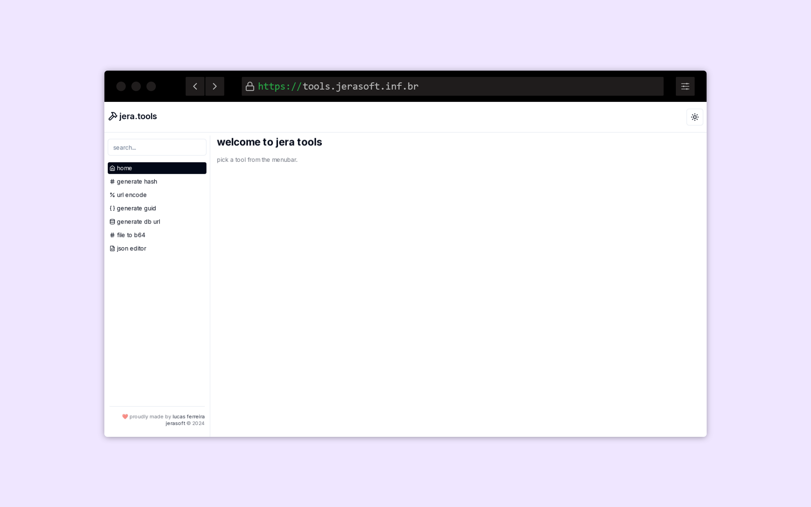

# jera.tools

[https://tools.jerasoft.inf.br](https://tools.jerasoft.inf.br)

made to solve some of my recurring daily problems as a developer. in constant development.

self-hosted in one of my own servers in Brazil.

## screenshots



## how to run

```bash
pnpm install
pnpm dev
```

## libs

- nextjs
- tailwindcss
- shadcn/ui
- react-ace-editor
- lucide

## authors

<table>
  <tbody>
    <td align="center">
      <a href="https://github.com/luccasfr">
        
        <p>Lucas Ferreira</p>
      </a>
    </td>
  </tbody>
</table>
